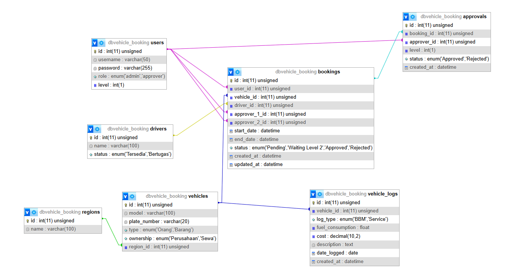

# Sistem Monitoring & Pemesanan Kendaraan Tambang (CI4)

Aplikasi ini dirancang untuk mengelola armada kendaraan di perusahaan tambang nikel, mencakup pemesanan dengan persetujuan berjenjang dan monitoring biaya operasional secara transparan.

## Dokumentasi Teknis

### 1. Physical Data Model (PDM)
Struktur database yang ternormalisasi dengan integritas data menggunakan Foreign Key Constraints.
 

### 2. Activity Diagram (Alur Pemesanan)
Proses persetujuan berjenjang dari Admin hingga Atasan Level 2.

## Tech Stack
- **Framework:** CodeIgniter 4.6.4
- **PHP Version:** 8.2.12
- **Database:** MySQL

## Akun Login
| Role | Username | Password |
| :--- | :--- | :--- |
| **Admin** | ahmad_admin | admin123 |
| **Atasan Level 1** | bambang_atasan1 | atasan123 |
| **Atasan Level 1** | dedi_kurniawan | atasan123 |
| **Atasan Level 2** | citra_atasan2 | atasan123 |

## Fitur Utama
1. **Pemesanan Kendaraan**: Input oleh Admin dengan pemilihan 2 level penyetuju.
2. **Multi-level Approval**: Persetujuan bertahap (Atasan 1 -> Atasan 2).
3. **Monitoring Operasional**: Riwayat konsumsi BBM dan biaya servis per kendaraan.
4. **Log Riwayat Pemakaian**: Menampilkan siapa saja yang pernah menggunakan kendaraan tertentu.
6. **Export Data**: Laporan pemesanan dalam format Excel.

## Panduan Instalasi
1. Ekstrak file project ke folder htdocs.
2. Jalankan `composer install` melalui terminal.
3. Buat database `db_tambang` dan import file SQL yang tersedia (atau atur di `.env`).
4. Jalankan migrasi: `php spark migrate`.
5. Jalankan seeder: `php spark db:seed MainSeeder`.
6. Run server: `php spark serve`.